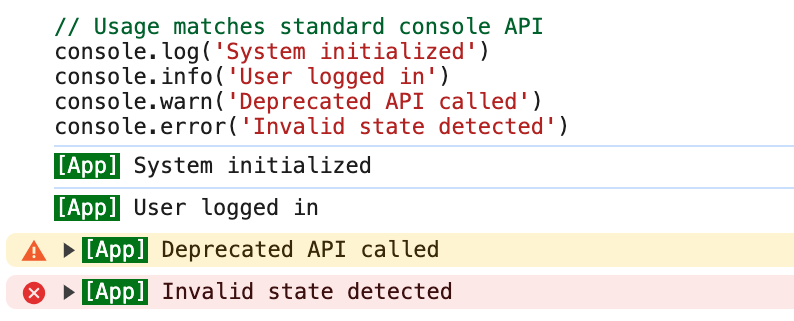

# console-tagger

[](https://www.npmjs.com/package/console-tagger)
[](https://opensource.org/licenses/MIT)

A lightweight console wrapper that adds customizable prefixes and CSS styling to browser console output.

## Features

- 🎨 Customizable prefix styling with text/background colors
- 🔍 Maintains original console functionality
- 📦 Simple API surface

## Installation

```bash
npm install console-tagger
```

## Usage

```js
import Console from 'console-tagger'

// Create console instance with prefix and styling
const console = new Console({
  prefix: 'App',
  color: {
    line: 'white',
    background: 'green',
  },
})

// Usage matches standard console API
console.log('System initialized')
console.info('User logged in')
console.warn('Deprecated API called')
console.error('Invalid state detected')
```



## API Documentation

### `new Console(options)`

Creates a new console instance with specified prefix and styling.

**Parameters**

- `options` (Object)
  - `prefix` (string): Text to display before messages
  - `color` (Object): Style options
    - `line` (string): CSS color value for text
    - `background` (string): CSS color value for background

**Browser Detection**
Styling is automatically disabled in non-browser environments.

### Instance Methods

- `log(...args)`
- `info(...args)`
- `warn(...args)`
- `error(...args)`

All methods match standard [Console API](https://developer.mozilla.org/en-US/docs/Web/API/console) signatures.

## Contributing

1. Fork the repository
2. Install dependencies: `npm install`
3. Make changes with tests
4. Verify code quality:

```bash
npm run lint   # Check code style
npm test       # Run unit tests
```

5. Submit pull request

---

📝 Report issues on [GitHub](https://github.com/utags/console-tagger/issues)

## License

Copyright (c) 2025 [Pipecraft](https://www.pipecraft.net). Licensed under the [MIT License](LICENSE).

## >\_

[](https://www.pipecraft.net)
[](https://utags.pipecraft.net)
